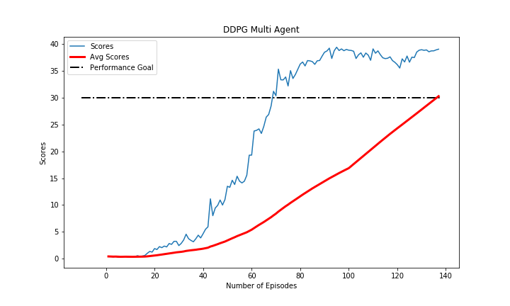

# Udacity DRLND - Continuous Control

This project entails a submisison for Udacity's Deep Reinforcement Learning Nanodegree Program: Project 2 - Continuous Control.


This project entails training a double-jointed arm in order to move to target locations. 

### Table of Contents 

1. [Project Description](#description)
2. [Requirements](#requirements)
3. [Training](#training)
4. [Files](#files)
5. [Project Results](#results)
6. [Licensing and Acknowledgements](#licensing)

### Project Description<a name="description"></a>

This project entails training a double-jointed arm in order to move to target locations. A reward of +0.1 is given to the agent for every step the agent's hand is within the goal location. This project aims to train the agent so that it is able to maintain its position at the target areas as long as possible.  

The following describes the Reacher environment.

1. Actions are consisted of vectors with four numbers corresponding to the torque applicable to two joints:
    - The entry of the action vector should be a number between -1 and 1
2. There are 33 observation spaces including:
    - Arm's position
    - Arm's rotation
    - Arm's velocity
    - Arm's angular velocity

The agent is considered to solve the environment once it attains an **average score of at least 30 over the past 100 consecutive episodes**.

### Requirements<a name="requirements"></a>

There are several requirements in order to run this project. 

- Configure Python3.6 and PyTorch environment as described in the [Udacity repository](https://github.com/udacity/deep-reinforcement-learning#dependencies).
- Install the Unity environment following the requirement [steps](https://github.com/udacity/deep-reinforcement-learning/blob/master/p2_continuous-control/README.md).
- Download the environment from one of the links below.  You need only select the environment that matches your operating system:

    - **_Version 1: One (1) Agent_**
        - Linux: [click here](https://s3-us-west-1.amazonaws.com/udacity-drlnd/P2/Reacher/one_agent/Reacher_Linux.zip)
        - Mac OSX: [click here](https://s3-us-west-1.amazonaws.com/udacity-drlnd/P2/Reacher/one_agent/Reacher.app.zip)
        - Windows (32-bit): [click here](https://s3-us-west-1.amazonaws.com/udacity-drlnd/P2/Reacher/one_agent/Reacher_Windows_x86.zip)
        - Windows (64-bit): [click here](https://s3-us-west-1.amazonaws.com/udacity-drlnd/P2/Reacher/one_agent/Reacher_Windows_x86_64.zip)

    - **_Version 2: Twenty (20) Agents_**
        - Linux: [click here](https://s3-us-west-1.amazonaws.com/udacity-drlnd/P2/Reacher/Reacher_Linux.zip)
        - Mac OSX: [click here](https://s3-us-west-1.amazonaws.com/udacity-drlnd/P2/Reacher/Reacher.app.zip)
        - Windows (32-bit): [click here](https://s3-us-west-1.amazonaws.com/udacity-drlnd/P2/Reacher/Reacher_Windows_x86.zip)
        - Windows (64-bit): [click here](https://s3-us-west-1.amazonaws.com/udacity-drlnd/P2/Reacher/Reacher_Windows_x86_64.zip)
    
    (_For Windows users_) Check out [this link](https://support.microsoft.com/en-us/help/827218/how-to-determine-whether-a-computer-is-running-a-32-bit-version-or-64) if you need help with determining if your computer is running a 32-bit version or 64-bit version of the Windows operating system.

    (_For AWS_) If you'd like to train the agent on AWS (and have not [enabled a virtual screen](https://github.com/Unity-Technologies/ml-agents/blob/master/docs/Training-on-Amazon-Web-Service.md)), then please use [this link](https://s3-us-west-1.amazonaws.com/udacity-drlnd/P2/Reacher/one_agent/Reacher_Linux_NoVis.zip) (version 1) or [this link](https://s3-us-west-1.amazonaws.com/udacity-drlnd/P2/Reacher/Reacher_Linux_NoVis.zip) (version 2) to obtain the "headless" version of the environment.  You will **not** be able to watch the agent without enabling a virtual screen, but you will be able to train the agent.  (_To watch the agent, you should follow the instructions to [enable a virtual screen](https://github.com/Unity-Technologies/ml-agents/blob/master/docs/Training-on-Amazon-Web-Service.md), and then download the environment for the **Linux** operating system above._)
    
- Place the environment in the preferred path.

### Training<a name="training"></a>

The notebook Continuous_Control_Multi_Agent.ipynb can be executed to train an agent. In training the agent, a policy based method is used. This method is called Deep Deterministic Policy Gradient (DDPG) where it implements a policy method with 2 networks, Actor and Critic. The method also implements replay buffer so that the agent can learn from random sampled experience. An implementation of Ornstein Uhlenbeck Noise (OUNoise) is also seen in this project. This is to enforce exploration (coupled with decaying epsilon values) within the training process of continuous control system. 

**Execute Continuous_Control_Multi_Agent.ipynb to train the agent using DDPG.**

### Files<a name="files"></a>

```
- Continuous_Control_Multi_Agent.ipynb # main notebook containing the training process and watching smart agent
- README.md
- Report.pdf # the report of the continuous control project, contains proeject approach, discussion, and future improvements

- ddpgarm
|- __init__.py 
|- ddpg_agent.py # agent class
|- model.py # network class
|- noise.py # ounoise class

- figures
|- ddpg_multi_agent.png # plot of multi agent scores
|- reacher.gif # environment overview

- saved_model
|- DDPG_actor_multi_agents.pth # model's weight for DDPG actor
|- DDPG_critic_multi_agents.pth # model's weight for DDPG critic

```

### Project Results<a name="results"></a>

The Reacher environment with 20 agents is explored using the DDPG method. The DDPG method is implemented by utilizing replay buffer, OUnoise, as well as Actor Critic networks. The combination of this method and the environment allows the agent to finish the training process only in 137 episodes. 



Although the agent solves the environment in relatively low number of episodes, each iteration (episodes) takes a lot longer time to complete due to the fact that the agent learns 10 times for every 20 timesteps. A large number of hyperparameters combinations are also explored although the configuration presented in the report is deemed to be the most optimal for the purpose of this project.

### Licensing and Acknowledgements<a name="licensing"></a>

Credits to Udacity [DRLND](https://www.udacity.com/course/deep-reinforcement-learning-nanodegree--nd893) for the sample code of DDPG for both bipedal and pendulum environments. This allows for a faster learning curve in how to implement said method to an environment. The environment is supported by [Unity mlagents](https://github.com/Unity-Technologies/ml-agents).
